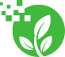

# Parco digitale della biodiversità umbra
> La biodiversità del cuore verde d'Italia fruibile in realtà alternata

## Indice

- [L'idea](#lidea)
- [La realizzazione](#la-realizzazione)
- [Licenze d'uso](#licenze-duso)

## L'idea

Il **Parco digitale della biodiversità umbra** consente agli utenti di sperimentare la ricchezza della biodiversità umbra in un ambiente di *realtà alternata*, ovvero fruibile in due modalità distinte e complementari:
  
  - la realtà virtuale, fruibile anche mediante opportuni visori su Mozilla Hubs, aggrega in un singolo ambiente artificiale le risorse genetiche censite nel Registro Regionale che nella realtà fisica si trovano in spazi anche molto lontani tra di loro;
  - l'app mobile, che guida fisicamente l'utente nel territorio umbro alla scoperta dei luoghi in cui si trovano le singole risorse genetiche.

## La realizzazione

Il progetto è stato realizzato da tre classi dell'I.I.S. "Casagrande-Cesi" di Terni, A.S. 2021-22, sotto la guida del prof. Paolo Bernardi: la 3A ITE-AFM, la 3H ITE-AFM-RIM e la 1M Professionale Enogastronomico.

Le sorgenti di dati utilizzate sono principalmente due:
  - la [tabella con i dettagli del Registro Regionale della biodiversità umbra](https://odn.regione.umbria.it/my_MM/dataset/dati-biodiversita/resource/b26a331f-161c-47a6-9fb2-c08bc685fccc?inner_span=True), resa disponibile dalla Regione Umbria come [risorsa Open Data](https://www.umbriadigitale.it/dati-umbria#);
  - le dettagliate [schede delle risorse genetiche di biodiversità iscritte al Registro regionale](https://biodiversita.umbria.parco3a.org/attivita/registro-regionale/elenco-delle-risorse-iscritte/), messe a disposizione da 3A Parco Tecnologico Agroalimentare dell Umbria, sia come pagine del loro sito che come [StoryMap interattiva](https://biodiversita.umbria.parco3a.org/storymap).

## Licenze d'uso

L'app mobile e l'ambiente virtuale prodotte nell'ambito del progetto **Parco digitale della biodiversità umbra** sono rilasciati con licenza GPL-3.

Gli Open Data della Regione Umbria utilizzati sono stati resi disponibili dall'Ente con licenza [Creative Commons Attribution](http://opendefinition.org/licenses/cc-by/).
